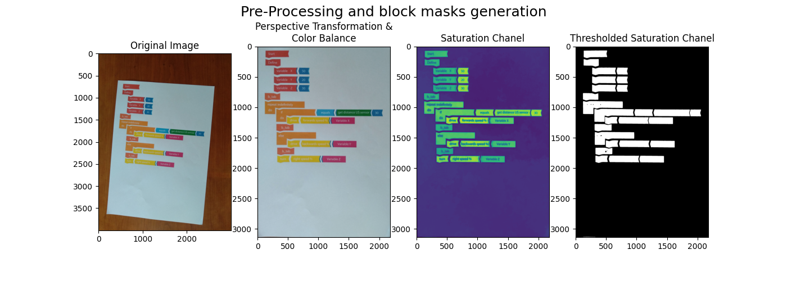
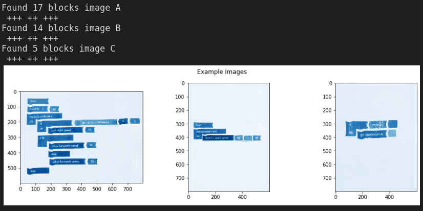
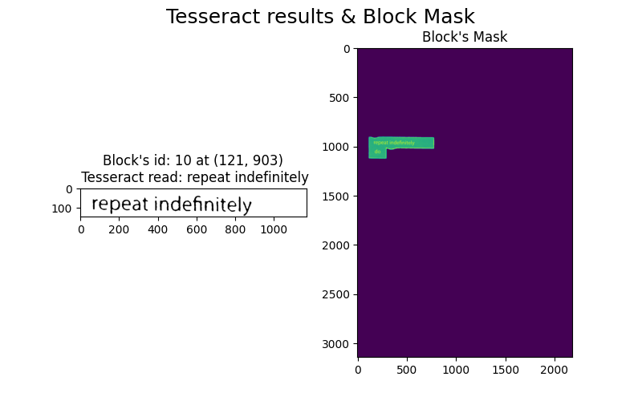
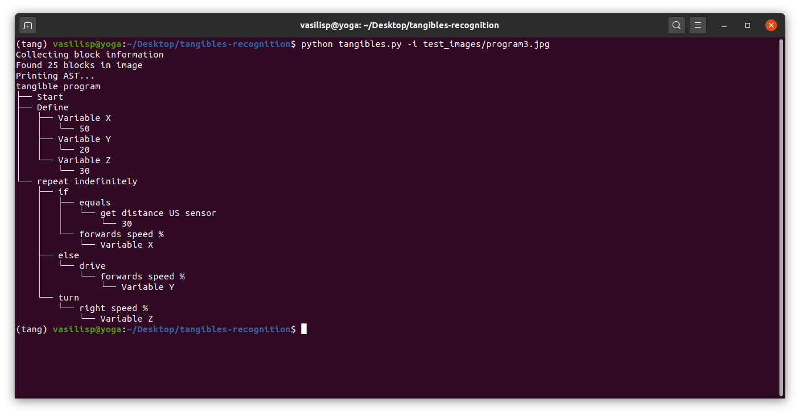

# Tangibles GSoC repo

[](https://mybinder.org/v2/gh/VasilisPoulos/tangibles-recognition/master)

I was selected by Open Roberta to work on a new feature as a participant in
Google Summer of Code 2020. The intent of the project was to
design real life coding blocks and create a prototype code block
recognition script that would enable their use in the Open Roberta Lab.
My approach for the recognition of the blocks is shown in the
`complex_example.ipynb` notebook. The python script is in the early
stages of its implementation but can succesfully process 2 example
images.
For more info go to my [gist](https://gist.github.com/VasilisPoulos/5176e80d0f8f4948e0549a58497d3b54).

## How to run

Use the `tang_env.sh` script as:

```shell
source tang_env.sh
```

This will create a python environment in the same directory as the python script
with all the required libraries installed.

Or, do the same process manually:

```shell
python -m venv tang-env
source tang-env

pip install --upgrade pip
pip install numpy
pip install matplotlib
pip install opencv-python==4.1.2.30
pip install pytesseract
pip install imutils
pip install anytree
sudo apt-get install tesseract-ocr
```

To run the tangibles python script on the test images use:

```shell
python tangibles.py -i test_images/program1.jpg
```

The script prints the correct AST in the terminal for all the images in the
`test_images` folder. Image `program2.jpg` requires the user to select the
correct edges of the paper.

to see all the arguments of the script use:

```shell
python tangibles.py -h
```

## Example images result explanation

The use case that this script is built around is the following: The input image contains
blocks from the `block set.pdf` that are forming an error free tangible program on a vertically
placed A4 paper that all it's edges are clearly visible.

Each of the examples satisfies the above use case and is processed following the below 5 steps.
This is an additional explanation to the existing comments of the code to summarize the processing
procedure.

### 1. Preparing the image for pre-processing

Before pre-processing we have to apply a perspective transform to
obtain the top-down view of the A4 paper. This is useful because
the resulting image of the transformation will have a nice
saturation contrast between the white paper and the tangible
blocks, that will help us later with the mask generation, but will
also align the text horizontally. To make sure this contrast will exist
in all images we white balance the output of the transformation using
the LAB color space. (Notebooks: [contrast.ipynb](contrast.ipynb),
[perspective-transformation.ipynb](experimentation\ notebooks/perspective-transformation.ipynb))



### 2. Pre-processing and block mask generation

To separate and label each block's mask from the image we convert it to
the HSV color space and apply Otsu's thresholding method on the
saturation chanel.



In the binarized image we apply dilation and then erosion morphological
transformations to get rid of any noise (e.g in
the second picture in the image above there are 14 'blocks' detected, see: 
[hsv.ipynb](experimentation\ notebooks/hsv.ipynb)) and
close the letter's gaps. The binary image
contains only black blocks on the exact same location of the
original image. Then using the connected components
method we can label every one of these features and later use
them as a mask for each block.

We iterate through all the features that were labeled in the previous
step filtering out the ones that their sum of non zero pixels is below
a set `low_filter` which is a percentage of the original image's size. Using the
blocks' masks that passed the filtering we dilate them again to remove
any gaps that were not removed in the previous morphological
transformations and find the top left x, y coordinates of each block by
their masks' contours. Finally we use the masks to crop the actual blocks
out of the original image.

### 3. Preparing text for OCR

The goal here is to generate black text on white background so that Tesseract OCR can detect each
block's text. First we calculate a `mean_height` of the blocks so that we can detect control
blocks (e.g if-do, repeat indefinitely etc.). If that fails, there is a set value in pixels as a height threshold. We then iterate
through all the blocks, cropping around each gray scaled one so the white text is on a darker
background and Otsu's thresholding method can produce an image that after dilation and
erosion can be successfully read by Tesseract.


### 4. Collecting data

At this point the image is ready to be read by OCR. To make the output text
reliable we compare the Tesseract output and match it to a list of
expected text. The x, y coordinates were collected in the mask generation step.
This information is saved in a 'code_block' object.

### 5. AST generation

Using the information that was collected we generate the AST of the
program using the anytree library. The 3 key functions that enable the generation are
`get_block_indented_to()`, `get_block_attached_to()`, `get_block_underneath()` that
return the indented, attached and the block underneath the input block respectively.
Another important part of the three's generation is the `nesting_node_list` list which
holds the necessary blocks that initiate a new indentation and a new nesting tangible
code block.


